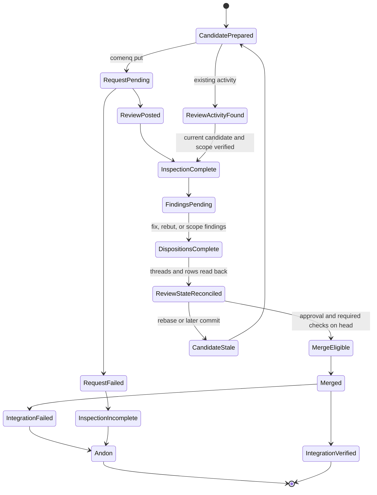
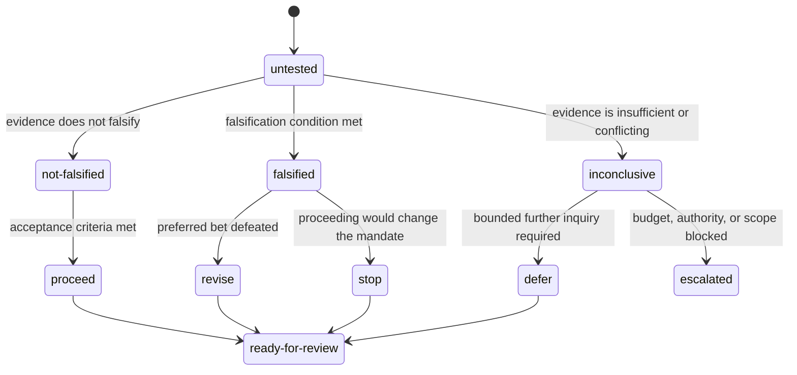

# Users' Guide

This guide explains how to run the helper bootstrap and how to configure it
with environment variables. It is written for people using the scripts, not for
people changing the scripts.

## Bootstrap model

The Rust bootstrap is split into two phases:

- `system`
  - Changes the machine layer.
  - Configures Ubuntu APT sources and third-party package repositories.
  - Installs APT packages, updates certificates, and applies optional global
    settings such as the `mold` linker override.
  - Uses a temporary helper checkout and does not intentionally manage the
    durable checkout under `$HOME`.
- `home`
  - Changes the user layer under `$HOME`.
  - Adds helper tool paths to shell startup files.
  - Clones or updates the managed helper checkout.
  - Installs user tools such as `uv`, `bun`, `rustup`, cargo tools, Bun global
    packages, skills, hooks, and sub-agent configuration.
  - Does not run APT, change `/etc`, change `/usr`, or mutate APT state.
- `both`
  - Runs `system` first and then `home`.
  - This is the default for the compatibility wrapper.

Run `system` for a fresh or reset system layer. Run `home` when creating or
refreshing a warm `$HOME` cache. In a warm-cache environment, run the phases
separately:

```bash
RUST_ENTRYPOINT_PHASE=system bash rust-entrypoint
RUST_ENTRYPOINT_PHASE=home bash rust-entrypoint
```

For a normal one-shot setup, use the default:

```bash
bash rust-entrypoint
```

The home phase expects the system phase to have prepared the packages and
shared libraries required by the user tools.

## Upgrading

See the [migration guide](v0-2-0-migration-guide.md) when moving from the previous
single-phase `rust-entrypoint` bootstrap to the system/home phase split.

### Post-turn quality stop hook removed

This repository no longer provides the post-turn quality stop hook. It has
moved to its own project. For installation, configuration, and support see
<https://github.com/leynos/post-turn-quality-stop-hook>.

## Skills

`install-skills` copies the `skills/` tree from the managed helper checkout
into the user's agent skills directory.

Each skill is a directory containing a `SKILL.md` whose YAML frontmatter
carries a required `name` field. That `name` is the discovery name a strict
loader uses; a manifest without it is not discoverable.

Each shipped skill directory matches its manifest `name`, so a skill can be
referred to by the same identifier on disk and at the point of discovery.

`make lint` validates every shipped manifest, so a malformed or
non-conformant manifest cannot be installed.

## CodeScene skills

Use [`codescene-cli`](../skills/codescene-cli/SKILL.md) to run local CodeScene
analysis with [`cs delta`](../skills/codescene-cli/references/command-reference.md#cs-delta),
[`cs review`](../skills/codescene-cli/references/command-reference.md#cs-review),
[`cs check`](../skills/codescene-cli/references/command-reference.md#cs-check),
and [`cs rules-config`](../skills/codescene-cli/references/command-reference.md#cs-rules-config).
Use [`codescene-health-rules`](../skills/codescene-health-rules/SKILL.md) to
configure CodeScene rule weights, thresholds, and source directives.

## Mutation-testing rollout

Use [`mutation-testing-rollout`](../skills/mutation-testing-rollout/SKILL.md)
to roll out scheduled, informational mutation testing across an estate of
repositories and to operate it afterwards; the runs never gate pull requests.
Invoke it to adopt mutation testing in a new repository, to triage the output
of scheduled runs, or to run an estate-wide sweep.

The skill documents the shared `mutation-cargo.yml` and `mutation-mutmut.yml`
reusable workflows behind thin, SHA-pinned callers, the adoption recipe and
its baseline hazards, the caller contract test, survivor triage, and run
sweeps. Run `install-skills` to copy it into `${HOME}/.codex/skills` and
`${HOME}/.claude/skills`; the `rust-entrypoint` home phase runs it too.

## Ansible testing

Use [`ansible-testing`](../skills/ansible-testing/SKILL.md) for local-first
Ansible testing of collections, roles, and modules: Molecule with Podman for
role behaviour, and `ansible-test` for sanity, unit, and integration tests.
For shared agent workspaces the skill's scheduling rules are:

- Agents must not apply external parallelism to repository gates.
- Agents must not run overlapping repository gates.
- A repository may own bounded internal scenario parallelism through its own
  documented test target and repository-defined concurrency controls, and
  agents use that internal parallelism only when that repository's guidance
  explicitly documents it.
- All other scenario commands and overlapping gates stay sequential by
  default.
- `MOLECULE_INSTANCE_SUFFIX` and fact-cache isolation stay mandatory
  regardless of the scheduling mode.

The skill carries the full Molecule and native-worker rules, including the
constraints that apply to native worker mode on CI or dedicated runners.

## Shared spelling tools

Run `make spelling` in this checkout to generate and validate the estate-wide
en-GB-oxendict configuration. The command uses the tracked shared base in
`data/typos-oxendict-base.toml`, merges repository-only exceptions from
`typos.local.toml`, writes generated `typos.toml`, and checks the repository
with the pinned `typos` version. It also rejects curated punctuation-separated
phrases that `typos` cannot treat as one word, reporting the canonical
replacement.

Consumer repositories use the same generation model. Their generator fetches
the shared base into ignored `.typos-oxendict-base.toml` and records freshness
metadata in `.typos-oxendict-base.json`. A valid cache supports offline runs;
the tracked `typos.toml` remains deterministic and reviewable.

Cache metadata is scoped to the exact authority that supplied it. A stale cache
or HTTP `304 Not Modified` response is accepted only when the metadata names
the requested source and the cached dictionary still validates. Switching local
paths or HTTPS URLs therefore forces a refresh without reusing another
authority's validators. Refresh decisions are available through standard Python
logging with bounded operation, source-kind, error-class and decision fields;
logs do not contain authority URLs or local paths.

The rollout CLI exposes the underlying operations:

```bash
uv run --script scripts/typos_rollout_cli.py generate --repository .
uv run --script scripts/typos_rollout_cli.py check --repository .
uv run --script scripts/typos_rollout_cli.py harvest ../project
```

`generate` accepts a local path or HTTP URL with `--source`, and `--offline`
requires an existing valid cache. `check` applies curated exact phrase
corrections to tracked text while respecting the merged ignore and exclusion
policy. `harvest` emits JSON Lines evidence for Oxford `-ize` and plain-British
`-ise` candidates in Git-tracked UTF-8 text. Generic spellings belong in the
shared base; product names, quoted upstream terms, and deliberate fixtures
belong in a consumer's `typos.local.toml`.

The curated base also normalizes nine common drift forms that replace `s` with
`z` in `otherwise`, `exercise` and `raise`. Each drifted form gains exactly one
canonical replacement, so consumers receive a single correction instead of
competing candidates:

```toml
"otherwize" = "otherwise"
"exercize" = "exercise"
"exercized" = "exercised"
"exercizes" = "exercises"
"exercizing" = "exercising"
"raize" = "raise"
"raized" = "raised"
"raizes" = "raises"
"raizing" = "raising"
```

Consumer repositories receive these mappings the next time they generate
configuration from the shared base: the corrections are rendered into their
tracked `typos.toml`, so no local overlay change is required.

Inline code is checked by default so misspelled identifiers, flags, module
paths and file names remain visible. Add exact identifier patterns to the
local `[patterns] ignore` list when an upstream name is intentionally spelled
differently. A local `[patterns] remove` list can withdraw an exact shared
ignore pattern when a repository needs stricter checking; removing a pattern
that the shared base no longer contains is a harmless no-op. Configuration
generation rejects an identical pattern in both local lists.

Ignore expressions are validated before scanning. Malformed expressions,
backreferences, and nested or adjacent repetitions are rejected, including
Python's `{,n}` upper-bound form; separated bounded repetitions remain valid.
Phrase checking and harvesting skip tracked files that are not UTF-8. Other
tracked-file read failures stop the operation and emit a bounded diagnostic, so
an incomplete repository scan cannot appear successful.

## Markdown linting

`make markdownlint` lints every Markdown file by naming the `**/*.md` glob and
reads this checkout's `.markdownlint-cli2.jsonc`. It is one of the gates
`make ci` runs, in order: `check-fmt`, `markdownlint`, `lint`, `typecheck`,
`test`, then `spelling`.

`make nixie` validates Mermaid diagrams with `nixie`. It is deliberately not
part of `make ci`, because it renders through an external Mermaid CLI
(`merman-cli`, or `mmdc` with Chromium) that the CI runner does not provide.
Run it locally when a change touches a diagram.

CI delegates the Markdown gate to the pinned
`DavidAnson/markdownlint-cli2-action` and therefore runs
`make ci CI_SKIP_MARKDOWNLINT=1`; that variable filters the Markdown gate out
of the gate list, which keeps the workflow and the Makefile in step rather
than restating the list.

`get-markdown-tooling` installs the `markdownlint` wrapper into consumer
repositories. A bare invocation appends the `**/*.md` glob, so it cannot
report a clean pass without having read a file. Explicit paths are honoured
as given, and two argument forms are deliberately not treated as paths, so no
glob is appended: a standalone `-`, which makes `markdownlint-cli2` read its
file list from standard input, and the operand of `--config` or
`--configPointer`, which names a configuration file. The wrapper uses the
repository's `.markdownlint-cli2.jsonc` when present, and otherwise supplies
a bundled default, so it works unchanged in a consumer repository that has
none. It resolves the linter from `PATH`, falling back to the bun global
install (`$HOME/.bun/bin/markdownlint-cli2`); `MDLINT_BIN` overrides both.

Its rationale and rule set are in the [developers' guide](developers-guide.md).

## Documentation library

The [documentation library](../documentation-library/README.md) holds the
canonical edition of every guidance document that the estate's repositories
share under `docs/`: the documentation style guide, the scripting standards,
the Rust, Python, front-end, and OpenTofu guides, and the users' guides of the
estate's own libraries. Each canonical edition merges the general improvements
found across the repository copies and omits repository-specific detail.

Refresh a repository's copy by overwriting it with the library file and
reviewing the diff. Improvements that belong to every repository go into the
library first; notes that belong to one repository stay in a document that
repository owns.

## Stacked pull requests

The `github-stacks` skill covers GitHub's native stacked pull requests through
the `gh stack` extension. Install it with
`gh extension install github/gh-stack`; it requires GitHub CLI 2.90.0 or later,
Git 2.20 or later, and stacked pull requests enabled for the repository. The
core workflow is `gh stack init`, `gh stack add`, `gh stack submit`, then
`gh stack sync` as the stack changes.

For automation, use non-interactive flags such as `--auto` and `--yes` because
some commands require a TTY, inspect state with `gh stack view --json`, and use
`gh stack push` instead of force-pushing stack branches manually. See the
[detailed skill](../skills/github-stacks/SKILL.md) and
[CLI reference](../skills/github-stacks/references/cli-reference.md).

## Entity-aware Git merges

The `weave-git-merge` skill covers Weave as a per-file, entity-aware Git merge
driver that Git invokes through `.gitattributes` during merges, rebases and
cherry-picks. It ships with the other skills through `install-skills`, which
installs the skill only and does not run `weave setup`; Weave itself must be
configured separately.

Treat the primary checkout as a read-only coordination anchor for unattended
merge and rebase work; never use it as a scratch, formatting,
conflict-repair, or rebase surface. Before any history rewrite, record the
candidate head (`OLD_HEAD`), the exact fetched target commit, and their merge
base. A completed rebase creates a new candidate, so gate and review evidence
tied to the old head is stale for acceptance and the candidate-bound checks
must be rerun against the new `HEAD`.

For unattended multi-commit or long-lived-branch rebases, the workflow
bypasses Weave by default when it is selected only through ambient global or
clone-local configuration, using Git's built-in merge machinery with
`merge.conflictStyle=zdiff3` instead. A tracked `.gitattributes` rule is
explicit repository opt-in and is respected unless an authorized recovery
says otherwise. This matters because Weave 0.3.6 has recorded clean-exit
corruption modes that pass parsers, compilers, and tests, so a clean exit and
a green suite are never acceptance evidence on their own.

When Weave is deliberately kept active, per-replay structural checks via
`git rebase --exec` are the default, and driver stderr — including
`weave: N entities auto-resolved` summaries and command-scoped `WEAVE_EVENT=1`
`weave-event:` JSON lines — must be preserved and read. A mandatory semantic
post-operation audit then runs independently of the driver's exit code and
the structural gates: target-changed but branch-untouched files must be
byte-identical to the target, every deletion against the target in a
branch-touched file must be explained, and newly repeated multi-line blocks
need inspection. Record `weave --version` and `weave-driver --version`, and
run `weave check` (or the MCP `weave_check` tool) when supported, while the
independent audit stays authoritative.

Failures of any of these checks are andon events: stop, preserve evidence,
and do not guess a repair. The `rebase` skill routes garbled or non-parsing
resolutions here. See the
[detailed skill](../skills/weave-git-merge/SKILL.md) and
[behaviour reference](../skills/weave-git-merge/references/behaviour.md).

## CodeRabbit reviews via comenq

The [`comenq-coderabbit`](../skills/comenq-coderabbit/SKILL.md) skill requests
CodeRabbit reviews through the managed `comenq` queue and carries the
review-response loop through evidence-backed convergence. `install-skills`
copies every immediate skill directory into the agent skill paths, so the skill
installs with the rest of the repository's skills; keep approved hosts,
credentials, and posting identities in deployment configuration rather than in
the skill itself.

Inspect the pending queue and recent pull-request activity before requesting
anything, and route new full reviews and retries through the queue rather than
a direct GitHub comment or a personal bot identity:

```bash
comenq list
comenq hist -n 20
comenq put OWNER/REPO PR_NUMBER "@coderabbitai review"
```

Focused replies to existing findings or pre-merge rows are a different
operation and use only the project's already authorized reply route. A posted
request, a completed review, a resolved thread, an approval, green checks, and
a successful integration are separate facts; the skill never substitutes one
for another, and it stops at an andon rather than guessing a repair. See
[failure modes and recovery](../skills/comenq-coderabbit/references/failure-modes-and-recovery.md)
for the incident-derived cases and their exit evidence, and
[evidence and rehearsal](../skills/comenq-coderabbit/references/evidence-and-rehearsal.md)
for the handoff and reconciliation templates and the offline rehearsal
scenarios.



Figure 1: the review lifecycle. A prepared candidate either receives a queued
`comenq put` request or already has review activity. A failed request leaves
inspection incomplete and stops at an andon rather than counting as a clean
review. A posted review, or activity verified against the current candidate and
scope, reaches inspection complete; findings then need dispositions and
reconciliation, which reaches merge eligibility only when approval and required
checks hold on the head. A rebase or later commit makes the candidate stale and
returns it to preparation. A merge is verified separately from integration, and
an integration failure is another andon stop.

## Hypothesis-driven debugging

The [`hypothesis-debugging`](../skills/hypothesis-debugging/SKILL.md) skill
plans a debugging investigation rather than performing it. It writes a
falsification plan and hands execution to a sub-agent, preferring `alchemist`.

Plans are written under `docs/debugging/`, which the skill creates when it is
missing. Each plan is named
`debugging-plan-<year>-<month>-<day>-<problem-slug>.md`: a four-digit year,
zero-padded month and day, then a lower-case, hyphen-separated slug naming the
problem under investigation. For example, a plan opened on 20 August 2026 for a
faulty ACP skill agent menu is
`debugging-plan-2026-08-20-acp-skill-agent-menu.md`.

The slug is required. The date alone sorts plans chronologically but leaves a
directory of indistinguishable filenames, so the slug is what makes a plan
identifiable without opening it. Earlier plans used an opaque
`debugging-plan-{timestamp}.md` name; see the
[migration guide](v0-2-0-migration-guide.md) for renaming them.

## VidaiMock

The [`vidai-mock`](../skills/vidai-mock/SKILL.md) skill covers VidaiMock, a
local mock server for LLM provider APIs. A single process serves
provider-shaped OpenAI, Anthropic, Gemini, Bedrock, and compatible endpoints
on port 8100 with no API key and no network access, because the bundled
providers and templates are compiled into the binary.

Use it for LLM integration tests that must exercise streaming, tool calls,
agentic loops, and failure handling without spending provider tokens. It
reproduces the parts of a real provider that tests depend on: time to first
token and token pacing, each provider's own streaming frame format, and
chaos injection that returns provider-shaped error envelopes so retry and
fallback logic engages the way it does in production.

Start it with `vidaimock --host 127.0.0.1`, confirm `GET /health` reports
`{"status":"ok"}`, then point the SDK under test at
`http://localhost:8100/v1`. The skill documents the critical path, the run
modes, provider and template configuration, the chaos controls, and the
built-in diagnostic paths `/health`, `/status`, and `/metrics`.

The skill targets `vidaimock` 0.3.1, and its commands were checked against
that release. It ships from this repository, so `install-skills` delivers it
with the other skills and no separate skill checkout is needed. See the
[migration guide](v0-2-0-migration-guide.md) if an earlier deployment
installed the skill from its own repository.

The `get-ai-tooling` helper, which runs only when `WITH_AI_TOOLING` is set,
currently downloads v0.1.2, so a machine provisioned through the bootstrap
runs an older release than the skill documents and some documented commands
and flags may not be available. Install 0.3.1, for example with
`cargo install vidaimock --version 0.3.1`, to match.

## Nextest

The [`nextest`](../skills/nextest/SKILL.md) skill covers `cargo-nextest`, the
Rust test runner that executes each test in its own process. It is the runner
the Rust gates use, and the skill documents what that model changes: process
isolation, per-test parallelism, and the failures that only appear once tests
stop sharing one process.

Use it when a Rust test run needs more than `cargo test` offers — sharding a
suite across CI runners, archiving a build and running it elsewhere, retrying
flaky tests, capping hung tests with timeouts, serializing tests that contend
for a database through test groups, or assigning port numbers to tests from
their slot number. It also covers the integrations that hang off the runner:
Miri, `cargo llvm-cov`, `cargo-mutants`, and Criterion benchmarks.

The skill targets `cargo-nextest` 0.9.143, and its commands were checked
against that release. The `get-rust-tooling` bootstrap currently installs
0.9.133 with `cargo binstall` at the pinned `CARGO_NEXTEST_VERSION`, so
features the skill marks with a version — the `cargo nextest help` topics,
the config JSON schemas, `junit.report-skipped`, and the relaxed filterset
parsing — are newer than what an unmodified bootstrap provides. Raise that
variable to 0.9.143 to use them.

It ships from this repository, so `install-skills` delivers it with the other
skills and no separate skill checkout is needed. See the
[migration guide](v0-2-0-migration-guide.md) if an earlier deployment
installed the skill from its own repository.

## Squash-restack boundaries

When a parent pull request is squash-merged, the child branch that was
stacked on it still carries the parent's original commits. Restacking the
child onto the new target requires an exclusive replay boundary
(`OLD_BASE`): the last commit the child inherited from the parent. `OLD_BASE`
is **not** the target merge-base, **not** the squash landing SHA, and **not**
the apparent first child commit — the graph's ordinary merge-base is only a
topology fact, and the squash commit is a landing record, not a boundary.
Choosing the wrong boundary either silently drops the first genuine child
commit or replays already-landed parent work back onto the target.

The [`rebase` skill](../skills/rebase/SKILL.md) and its
[squashed-parent reference](../skills/rebase/references/squashed-parent.md)
document how to establish this boundary and audit a replay against it. See
also the [Stacked pull requests](#stacked-pull-requests) and
[Entity-aware Git merges](#entity-aware-git-merges) sections above for the
surrounding stack and merge-driver context.

### Planning a restack

For a confirmed squash-merged parent with a known pull request identity, the
skill bundles a planner, `skills/rebase/scripts/plan_restack.py`. It is a
Cyclopts command-line tool run with `uv run`, and requires Python 3.13 or
later and an authenticated `gh`:

In the common case, no maintained `refs/stack-bases/<branch>` receipt exists
and the parent head is still inherited, so `--boundary-ref` is left off
entirely:

```bash
uv run skills/rebase/scripts/plan_restack.py . \
  --branch "$BRANCH" --target-ref "$TARGET_REF" \
  --parent-repository "$PARENT_REPOSITORY" --parent-pr "$PARENT_PR"
```

When a maintained `refs/stack-bases/<branch>` receipt exists, pass it via
`--boundary-ref`:

```bash
uv run skills/rebase/scripts/plan_restack.py . \
  --branch "$BRANCH" --target-ref "$TARGET_REF" \
  --parent-repository "$PARENT_REPOSITORY" --parent-pr "$PARENT_PR" \
  --boundary-ref "$BOUNDARY_REF"
```

The positional argument is the repository path (`.` for the current
checkout). `--boundary-ref` is optional: either pass it with a receipt's
value, or leave the whole flag off. An empty value is not the same as
omitting it — the planner rejects an empty `--boundary-ref` rather than
treating it as absent.

The planner leaves branches, tracking refs, the index, and the working tree
unchanged: it never rebases, pushes, or prunes. Discovery does write one
thing, deliberately: it fetches the parent pull request's head into a
private `refs/agent-rebase/…` evidence ref, retained for later review and
recovery. The read path, `build_plan()`, performs no ref writes and no
network access at all.

A successful run prints a JSON plan to standard output with
`status: review-required`, or `status: no-op-decision-required` when the
computed range is empty. That status is a request for human or agent review;
it is never authorization to replay. The plan carries `boundary_evidence`
(the provenance of the chosen `OLD_BASE`), `boundary_corroborated` (whether
preserved parent history proves the boundary), `evidence_ref` (the private
fetch ref), `commits` (the exact ordered commit list the plan proposes to
replay), and `rebase_argv` (the exact proposed rebase command). A blocked run
prints a `status: blocked` JSON object on standard error and exits with
status 2; treat this, and any `gh` or fetch error, as a stop, not as a
negative ancestry result.

### What the operator still owns

The planner narrows the evidence gathering; it does not discharge review.
The operator (human or supervising agent) still owns:

- Confirming the parent relationship and that the parent pull request was
  actually squash-merged, not merged by another method.
- Judging the freshness of any boundary receipt and the ownership of each
  commit in the proposed range.
- Applying worktree, merge-driver and acceptance policy, including the
  [Weave driver-selection checks](../skills/weave-git-merge/SKILL.md) and the
  repository's formatting, lint, type and test gates, before and after
  replay.

### Do not use `gh stack sync --prune` for discovery

`gh stack sync --prune` must not be used as a way to discover the replay
boundary. It can rebase, push and prune branches — destroying recovery
evidence — before any proposed range has been reviewed. A clean `gh stack
sync` exit is a safety net against a diverged remote, not proof of replay
ownership: it says nothing about which commits each layer owns, so it cannot
by itself confirm that no inherited parent commit remains in a cascading
rebase. Establish and review the boundary evidence first.

### Host restriction

The bundled planner's fetch currently targets `github.com` explicitly, even
when the child branch lives in a fork. Other GitHub hosts (for example
GitHub Enterprise Server) are not supported by the planner and need the
separately documented recovery path in the
[squashed-parent reference](../skills/rebase/references/squashed-parent.md).

## Common settings

### `RUST_ENTRYPOINT_PHASE`

Default: `both`

Allowed values:

- `system`
- `home`
- `both`

Use this to select which bootstrap phase the `rust-entrypoint` wrapper runs. Use
`both` for ordinary setup, `system` for a fresh system layer, and `home` for
warm `$HOME` cache creation or refresh.

### `UBUNTU_APT_MIRROR`

Default: `http://mirror.math.princeton.edu/pub/ubuntu/`

The system phase writes an Ubuntu source definition that points at this mirror.
Set when a local, regional, private, or provider-managed Ubuntu mirror is
required.

```bash
UBUNTU_APT_MIRROR=http://archive.ubuntu.com/ubuntu/ \
  RUST_ENTRYPOINT_PHASE=system \
  bash rust-entrypoint
```

### `WITH_LETA_WORKSPACE_ADD`

Default: `1`

`get-github-tooling` installs `leta`. By default, it also runs:

```bash
leta workspace add .
```

Set `WITH_LETA_WORKSPACE_ADD=0` when creating a generic warm `$HOME` image or
when the current directory should not be registered as a `leta` workspace.

## Helper checkout settings

The home phase manages a sparse checkout of this repository. Other helper
scripts reuse the same checkout when these variables are exported.

- `HELPER_TOOLS_REPO_URL`
  - Default: `https://github.com/leynos/agent-helper-scripts.git`
  - Git repository to clone for helper scripts.
  - Set this to test a fork or mirror.
- `HELPER_TOOLS_REPO_BRANCH`
  - Default: `main`
  - Branch to fetch and reset the helper checkout to.
  - Set this to test branch-specific bootstrap changes.
- `HELPER_TOOLS_REPO_NAME`
  - Default: derived from `HELPER_TOOLS_REPO_URL`
  - Directory name used when `HELPER_TOOLS_REPO_DIR` is not set.
- `HELPER_TOOLS_REPO_DIR`
  - Default: `${HOME}/git/${HELPER_TOOLS_REPO_NAME}`
  - Managed helper checkout path.
  - Set when an isolated checkout is required.
- `REPO_DIR`
  - Default: `HELPER_TOOLS_REPO_DIR`, then
    `${HOME}/git/agent-helper-scripts`
  - Checkout used by `install-hooks` and `install-skills`.
  - Most users should leave this unset and configure
    `HELPER_TOOLS_REPO_DIR` instead.

Example:

```bash
export HELPER_TOOLS_REPO_BRANCH=my-feature-branch
export HELPER_TOOLS_REPO_DIR="$HOME/git/agent-helper-scripts"
bash rust-entrypoint
```

Use `main` for the published helper scripts, or replace it with a specific
helper branch when testing unpublished bootstrap changes.

## Feature toggles

### Repository and system toggles

- `WITH_ADD_REPOSITORIES`
  - Default: `1`
  - Runs `add-repositories` during the system phase.
  - Set to `0` when the image already has the required repositories.
- `INSTALL_GLOW`
  - Default: `0`
  - Adds the Charm repository and installs the APT `glow` package in the
    system phase.
- `WITH_MOLD_LD_OVERRIDE`
  - Default: `0`
  - Replaces `/usr/bin/ld` with a symlink to `/usr/bin/mold` when enabled.
  - This is a global linker change. Enable it only for images where that
    behaviour is intended.
- `WITH_TRACE`
  - Default: `0`
  - Enables Bash xtrace (`set -x`) in the deployment entrypoints and helper
    scripts.
  - Use for debugging bootstrap failures. Avoid enabling it in logs that may
    contain sensitive environment values.

### Tooling toggles

- `WITH_AI_TOOLING`
  - Default: `0`
  - Adds `get-ai-tooling` to the home-phase helper list.
- `WITH_VALE`
  - Default: `0`
  - Installs Vale through Bun in `get-markdown-tooling`.
- `WITH_LLVM_COV`
  - Default: `1`
  - Installs `cargo-llvm-cov` in `get-rust-tooling`.
- `WITH_WHITAKER`
  - Default: `0`
  - Installs Whitaker tooling in `get-rust-tooling`.
- `WITH_WHITAKER_EXPERIMENTAL`
  - Default: `0`
  - Installs experimental Whitaker pieces when Whitaker is enabled.
- `RUST_PRE_BUILD`
  - Default: `0`
  - Makes `rust-setup` run `cargo check --workspace --all-targets`.
  - Leave disabled when creating a generic warm `$HOME` cache.
- `RUST_ANALYZER_PRECHECK`
  - Default: `0`
  - Runs `rust-analyzer analysis-stats .` before the optional pre-build when
    `rust-analyzer` is available.

## Tool version settings

Use these variables to pin or override versions installed by the home phase:

- `VENDCURL_VERSION`
  - Default: `0.1.0`
  - Version installed with `uv tool install`.
- `RUST_CHANNEL`
  - Default: `stable`, unless `rust-toolchain.toml` declares a channel.
  - Rust toolchain installed by `rustup`.
- `CARGO_LLVM_COV_VERSION`
  - Default: `0.8.5`
  - Version of `cargo-llvm-cov`.
- `CARGO_NEXTEST_VERSION`
  - Default: `0.9.133`
  - Version of `cargo-nextest`.
- `KANI_VERIFIER_VERSION`
  - Default: `0.67.0`
  - Version of `kani-verifier`.
- `SCCACHE_VERSION`
  - Default: `0.14.0`
  - Version of `sccache` when `SCCACHE_BUCKET` is set.
- `WHITAKER_INSTALLER_VERSION`
  - Default: `0.2.6`
  - Version of `whitaker-installer`.
- `MDTABLEFIX_VERSION`
  - Default: `0.4.0`
  - Version of `mdtablefix`.
- `ACT_VERSION`
  - Default: `latest`
  - GitHub `act` release installed by `get-github-tooling`.
- `MERGIRAF_VERSION`
  - Default: `0.16.3`
  - Version of `mergiraf`.
- `DIFFTASTIC_VERSION`
  - Default: `0.68.0`
  - Version of `difftastic`.
- `LETA_VERSION`
  - Default: `0.13.0`
  - Version of `leta`.
- `ACTION_VALIDATOR_VERSION`
  - Default: `0.9.0`
  - Version of `action-validator`.
- `VK_VERSION`
  - Default: `0.5.0`
  - Version of `vk`.
- `CHECKMAKE_VERSION`
  - Default: `0.2.2`
  - Version of `checkmake`.

## Cache and cloud settings

### Cargo home

- `CARGO_HOME`
  - Default: `${HOME}/.cargo`
  - Cargo home directory used by Rust tooling and Kopia cache restore.

### Kopia cargo cache

Set `KOPIA_BUCKET` to enable Kopia-backed cargo cache restore and snapshot. The
system phase installs the `kopia` package when this is set. The home phase
connects to the repository, restores the cache, and snapshots it again after
tool installation.

- `KOPIA_BUCKET`
  - S3 bucket name.
- `KOPIA_CREATE`
  - Default: `0`
  - Set to `1` to create the Kopia repository before connecting.
- `KOPIA_ENDPOINT`
  - S3-compatible endpoint.
- `KOPIA_REGION`
  - S3 region.
- `AWS_ACCESS_KEY_ID`
  - Access key passed to Kopia.
- `AWS_SECRET_ACCESS_KEY`
  - Secret key passed to Kopia.

### `sccache`

Set `SCCACHE_BUCKET` to install and configure `sccache` for Rust builds.

- `SCCACHE_BUCKET`
  - Enables `sccache` setup.
- `SCCACHE_WEBDAV_ENDPOINT`
  - Optional WebDAV endpoint for `sccache`.
- `SCCACHE_VERSION`
  - Version of `sccache` to install.

## Sub-agent and context-pack settings

`install-sub-agents` can install `mcp-context-pack` into the user environment.
These variables customize that installation:

- `CONTEXT_PACK_REPO`
  - Default: `AmirTlinov/mcp-context-pack`
  - GitHub repository that publishes `mcp-context-pack` releases.
- `CONTEXT_PACK_VERSION`
  - Default: `latest`
  - Release version to install.
- `CONTEXT_PACK_INSTALL_DIR`
  - Default: `${HOME}/.local/bin`
  - Directory that receives the `mcp-context-pack` binary.

## Sub-agent definitions

`agents/subagents.yml` is the provider-neutral manifest of the managed
sub-agent definitions (currently `wyvern`, `scribe`, `alchemist`,
`scrutineer`, `journeyman`, `artisan`, and `natural-philosopher`). Each entry
carries a shared `description` and `instructions` body plus per-provider blocks
for Codex CLI, Claude Code, and goose. Downstream provisioning tooling (for
example the dev-env-rocky `agent_tools` Ansible role) loads the manifest from a
checkout of this repository and renders each enabled provider's native
configuration file. The schema is documented in the manifest's header comment,
and the deployment contracts are pinned by `tests/test_subagent_definitions.py`
and `tests/test_natural_philosopher.py`.

`natural-philosopher` designs evidence-led steps for one selected GIST idea
and its parent goal. Supply the relevant sources, existing IDs, constraints,
owned document paths, inquiry budget, and experiment permissions. It reads
`roadmap-doc`, returns hypotheses, coherent workstreams, evidence criteria,
and decision gates, and leaves approval to the parent. It may use bounded
Wyvern reconnaissance or explicitly authorized Alchemist experiments when
the host supports delegation. Without experiment authority it designs only;
without owned document paths it returns a report rather than editing files.
See [ADR 004](adr/004-natural-philosopher-step-design.md) for the contracts,
provider limits, and a worked example.

Each hypothesis carries its own verdict, which the report keeps separate from
its overall status. The diagram below traces one hypothesis from `untested`,
through a verdict and a decision gate, to the status the report returns.



*Hypothesis verdicts, the decision gate each one reaches, and the report
status that follows. A verdict describes one hypothesis; a status describes
the whole report.*

`scrutineer` runs a summoned assignment in up to three modes: the
deterministic local commit gates, an optional `coderabbit review --agent`
pass run only when explicitly requested, and GitHub Actions monitoring. A
monitoring-only assignment watches the requested runs without starting
local gates or a new review; those activities are reported as
`not-requested` rather than passed or silently skipped. A docs-only diff,
where every changed path ends in `.md`, scopes the gate set to
`make markdownlint` and `make nixie`.

Actions monitoring correlates an explicit repository, expected commit
SHA, run ID and attempt; PR-head, synthetic-merge and post-merge
integration evidence are kept distinct, and the latest run on a branch is
never substituted for the assigned candidate. Candidates are resolved
from the pull request's own check links or from an exact commit; checks
that are not Actions runs are classified separately rather than
monitored, and every candidate is verified before it is watched. A
deadline bounds the watcher itself, and reaching it stops only local
observation:
`scrutineer` never reruns, cancels, dispatches, approves or merges, and
it does not cancel hosted runs when the deadline is reached.
Only `status=completed` with `conclusion=success` counts as success;
pending, cancelled, skipped and neutral states are preserved, and
CLI, credential or API problems are reported as `infrastructure-error`
rather than as a workflow failure. Every observed run and attempt
contributes run metadata and watcher output (`run.json`, `watch.log`)
to a private bundle under `/tmp`, alongside a root `summary.md`.
Failed-step logs (`failed.log`) are captured only for a run that
reaches `status=completed` with a non-success `conclusion`; a run still
pending at the deadline is reported with the evidence gathered so far
and its last known status, treated as neither success nor failure, and
it has no failure-log artefact. When capture does not apply, the
bundle carries a short `failed-log.omitted` note recording the
observed status and conclusion, so a missing failure log is never
ambiguous. Missing, expired or inaccessible logs are reported
explicitly, with the reason, rather than read as success.
`scrutineer` never edits tracked files.

`journeyman` delivers one full approved ExecPlan, or one named plateau of it,
end-to-end. It may delegate small, bounded, measurable, testable work items to
`artisan` agents.

`artisan` accepts exactly one bounded task packet. It cannot delegate and
must escalate incomplete packets or work outside the packet's scope.

Managed subagents receive the MCP servers provisioned by the parent agent
client. Every subagent's Claude allow-list includes CodeGraph; the
`journeyman` and `natural-philosopher` allow-lists also include Firecrawl and
DeepWiki. Codex subagent entries deliberately omit `mcp_servers`, so Codex
inherits the complete credentialed parent registry. Goose recipes omit
`extensions`, so goose inherits the parent's configured extensions. As a
result, Codex and goose may expose other parent MCPs to every role, while
Claude access stays limited to the listed allow-lists. Tool access never
expands the assignment's authority.

## OpenTofu helper settings

These variables apply when running `get-open-tofu-tooling` directly. That
helper is not part of the default `rust-entrypoint` helper list.

- `TFLINT_VERSION`
  - Default: `latest`
  - Version of `tflint`.
- `TFLINT_INSTALL_PATH`
  - Default: `/usr/local/bin`
  - Install path used by the upstream `tflint` installer.
- `CONFTEST_VERSION`
  - Default: `latest`
  - Version of `conftest`.

## Less common process settings

- `DEBIAN_FRONTEND`
  - Default: `noninteractive`
  - Exported by the bootstrap so APT does not prompt during unattended setup.
  - Most users should leave this unset.

Internal variables such as `SELECTED_TOOLS`, `PACKAGE_SCRIPTS`, and
`HELPER_TOOLS_SPARSE_PATHS` are implementation details. They are not stable
configuration points.
