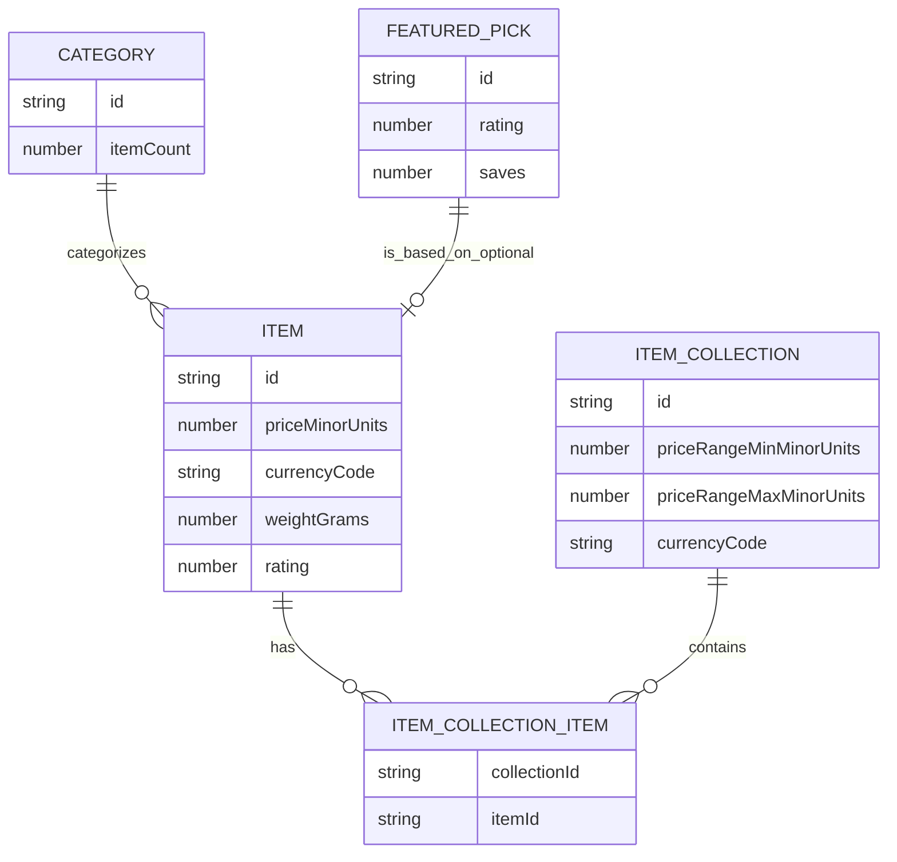
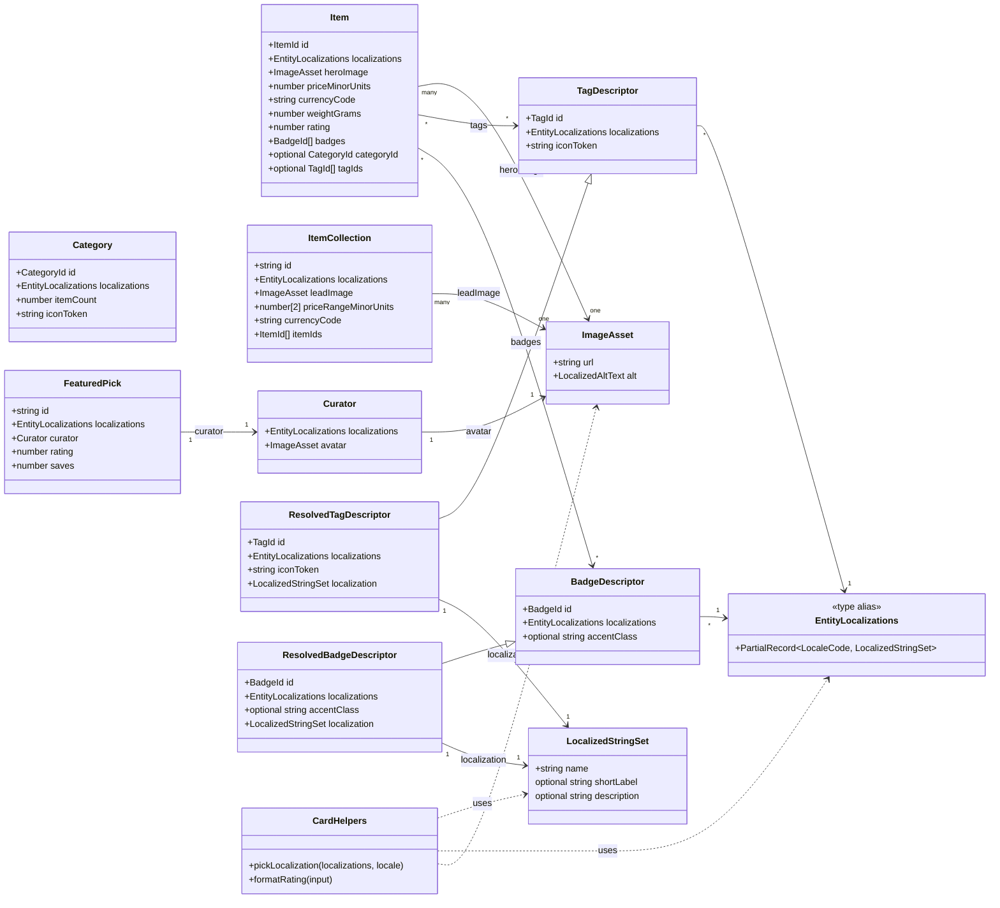

# Data model-driven card architecture

## Purpose

Every card in the product must render from a concrete entity data model that
already contains its localized strings and International System of Units
(SI)-based measurements. Locale bundles should keep only UI chrome and
formatting scaffolding, never entity content. This document defines the
schemas, localization rules, and migration steps needed to align a codebase
with that principle.

For a backend-compatible perspective (hexagonal domain boundaries, ports, and
offline-first persistence), see the backend architecture documentation for
the project.

## Principles to enforce

- Entity models own their names, descriptions, badges, and imagery per
  locale.
- Attribute labels come from stable internal identifiers resolved via
  descriptor registries (for example categories, priorities, statuses, and
  tags).
- Numeric values are stored in SI base units; conversion happens at render
  time via shared unit-format helpers.
- Currency is an explicit exception to SI base-unit storage: prices are
  stored as integer ISO 4217 minor units, and every price carries an ISO
  4217 currency code.
- Counts stay as integers; pluralization belongs to the translation system.
- Components receive fully formed entities and only format/present them.

## Auditing existing card usage

Before migrating, inventory every screen or view that renders cards. For
each one, record:

- the component file that owns the card markup;
- the entities and fields it renders;
- the current data source (fixtures, a data module, or translation keys);
  and
- whether names, descriptions, and badges are hard-coded, split between
  fixtures and translation keys, or already entity-driven.

This inventory becomes the migration backlog: screens whose strings are
entirely hard-coded or split across translation keys are the ones this
architecture will change first.

## Shared model building blocks

Use these primitives across entities:

```ts
export type LocaleCode = "en-GB" | "en-US" | "fr" | "de" | "es" | "ar";

export type ItemId = string;
export type CategoryId = string;
export type TagId = string;
export type BadgeId = string;

export type LocalizedStringSet = {
  readonly name: string;
  readonly description?: string;
  readonly shortLabel?: string;
};

export type EntityLocalizations = Partial<Record<LocaleCode, LocalizedStringSet>>;

export type LocalizedAltText = Partial<Record<LocaleCode, string>>;

export type ImageAsset = {
  readonly url: string;
  readonly alt: LocalizedAltText;
};
```

`LocaleCode` should list the locales the project actually supports.
`EntityLocalizations` and `LocalizedAltText` are `Partial` records because a
newly added locale will not have every entity translated immediately.

Fallback rule: resolve using a deterministic order — the current user
locale, then the designated default locale, then an explicit, stable
fallback locale list — and take the first locale in that order that has
the required value. Do not fall back to object insertion order or to any
arbitrary available locale. Components must not construct names from
translation keys. The same ordered fallback governs both entity names and
localized image alt text.

## Entity schemas by card type

The schemas below use a generic catalogue domain to illustrate the pattern;
apply the same shapes to the entities in the target domain.

- **Item (primary content/product cards)**
  - `id: ItemId` (stable slug)
  - `localizations: EntityLocalizations` (name, description)
  - `heroImage: ImageAsset`
  - `priceMinorUnits: number` (integer ISO 4217 minor units, e.g. pence or
    cents)
  - `currencyCode: string` (ISO 4217 currency code for `priceMinorUnits`)
  - `weightGrams: number` (SI)
  - `rating: number` (0–5)
  - `badges: BadgeId[]` (badge descriptor ids)
  - `categoryId?: CategoryId`
  - `tagIds?: TagId[]`
- **ItemCollection (curated collection cards)**
  - `id`, `localizations`
  - `leadImage: ImageAsset`
  - `priceRangeMinorUnits: [number, number]`
  - `currencyCode: string` (ISO 4217 currency code for
    `priceRangeMinorUnits`)
  - `itemIds: ItemId[]`
- **Category (category chips)**
  - `id`
  - `localizations` (name only)
  - `iconToken: string`
  - `itemCount: number`
- **FeaturedPick (curator or editorial panel)**
  - `id`, `localizations`
  - `curator: { localizations; avatar: ImageAsset }`
  - `rating: number`, `saves: number`

Descriptor registries follow the same shape for any resolved attribute, for
example:

- **TagDescriptor** — `id`, `localizations`, `iconToken`
- **BadgeDescriptor** — `id`, `localizations`, optional `accentClass`

## Visual model references

Figure 1 illustrates the entity relationships for items, collections, and
featured picks, mapping how cards should compose their data inputs.



Figure 2 sketches the class-level model with localization-aware fields and
asset references that underpin the card architecture.



## Localization handling rules

- Every entity exposes `localizations`; UI selects the matching locale once
  per render using a `pickLocalization(entity, locale)` helper.
- Translation bundles (for example Fluent) keep only chrome (button labels,
  aria labels, unit labels, plural rules). Remove entity names,
  descriptions, and badges from translation bundles once migration lands.
- Descriptor registries store `localizations` instead of a `labelKey` and
  `defaultLabel` pair.
- Component props shift from `title`/`description` strings to entire entity
  objects. Non-currency helpers (e.g., a weight formatter) continue to
  format numbers with translated unit labels. `formatPrice` instead
  receives the minor-unit value together with its `currencyCode` and
  selects currency formatting from that code, never from translated unit
  labels.

## Attribute identifier strategy

- Continue to use descriptor ids (`categoryId`, `tagId`) as the canonical
  internal keys.
- Introduce a `tagDescriptors` registry to replace ad-hoc tag strings; each
  tag owns its `localizations` and icon metadata.
- Badge chips use `badgeDescriptors` rather than free text.

## Proposed folder layout

- `src/app/domain/entities/` for TypeScript models and shared helpers
- `src/app/data/entities/` for fixture instances in the new shape
- `src/app/data/registries/` for tag and badge descriptor registries
- `src/app/i18n/` keeps translation plumbing; UI chrome strings remain there

## Migration roadmap

- **Phase 0: foundations**
  - Add shared types (`EntityLocalizations`, `ImageAsset`, locale list) and
    a `pickLocalization` helper with deterministic fallback.
  - Introduce descriptor registries for the identifiers used across the
    codebase (categories, tags, badges, and any others from the audit).
- **Phase 1: highest-traffic screens**
  - Reshape the data module behind each screen into the new entity shapes
    with localization maps.
  - Update the components to consume entities and call
    `pickLocalization`; drop the corresponding keys from translation
    bundles.
- **Phase 2: remaining feature screens**
  - Convert any remaining option lists and toggles to entity-based inputs,
    replacing per-option translation keys.
  - Reshape list and detail cards; ensure tags resolve via registries and
    unit formatting covers all numerical values.
- **Phase 3: hardening**
  - Write unit tests for `pickLocalization` fallbacks and descriptor
    resolution.
  - Run the project's quality gates (format, lint, type-check, and test).
  - Remove obsolete translation keys and document the final schema.
